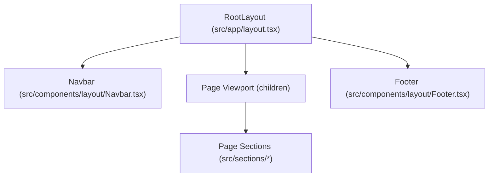
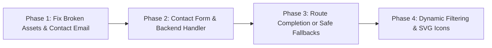

# Software Requirements Specification (SRS) & Implementation Audit
## Catalyst Digital Web Platform

**Document Version:** 1.0.0  
**Project:** Catalyst Digital Corporate Portfolio  
**Target Environment:** Next.js 16.2.3 (App Router), React 19.2.4, Tailwind CSS 4, TypeScript 5  
**Audit Date:** September 14, 2026  
**Status:** Baseline As-Built Specification & Gap Audit  

---

## 1. Executive Summary & System Overview

### 1.1 Purpose and Scope
This Software Requirements Specification (SRS) provides an exhaustive, authoritative blueprint of the **Catalyst Digital** web platform. It establishes complete technical and content clarity for stakeholders, engineering teams, and clients regarding the structural components, user interface elements, copy, data contracts, and interactive behaviors across all public pages.

Every section of the running web platform has been audited against the codebase and live application runtime. All content strings, data schemas, input forms, and discrepancies between project documentation and the actual implementation are documented herein.

### 1.2 System Identity & Brand Guidelines
- **Organization Name:** Catalyst Digital
- **Corporate Tagline:** *"A Software Development Studio building practical, scalable solutions for real operational challenges."*
- **Primary Domain Identity:** Digital Product Engineering Partner
- **Corporate Location:** Colombo, Sri Lanka
- **Contact Channels:**
  - Phone: `+94 72 280 0104`
  - Email: `ceo@catalystdigitals.com` (Contact Module) / `hceo@catalystdigitals.com` (Global Footer / Site Config)
  - Social: [LinkedIn Corporate Profile](https://www.linkedin.com/company/catalyst-digital)

### 1.3 Technical Architecture & Stack
| Layer | Technology | Version | Purpose |
| :--- | :--- | :--- | :--- |
| **Framework** | Next.js (App Router) | 16.2.3 | Server-Side Rendering (SSR), Server Components (RSC), Routing |
| **Language** | TypeScript | 5.x | Strict static typing and interfaces |
| **UI Library** | React | 19.2.4 | Modern React component model |
| **Styling** | Tailwind CSS | 4.x | Utility-first CSS via `@import "tailwindcss"` and `@theme inline` |
| **Typography** | Geist Sans & Geist Mono | Next/Font | Variable primary and monospace font families |
| **Utilities** | `clsx`, `tailwind-merge` | Latest | Conditional styling and class merging via `cn()` helper |

### 1.4 The 5-Layer Architectural Standard
The project enforces a strict unidirectional dependency hierarchy. Files in a higher layer may import only from layers directly or indirectly beneath them:
```
Layer 5 — app/                  → Route entry points only; zero business logic
Layer 4 — sections/             → Self-contained page sections composed from features
Layer 3 — components/features/  → Domain-aware components (Cards, Forms, Accordions)
Layer 2 — components/ui/        → Domain-agnostic UI primitives (Button, Heading, Card, Input)
Layer 1 — styles, types, data, config, lib, hooks → Pure data, interfaces, tokens, and utilities
```

---

## 2. Global Layout & Structural Specifications

The root application layout defined in [`src/app/layout.tsx`](file:///Users/ridmashehan/catalyst-digital/src/app/layout.tsx) wraps every route with a persistent Header (`Navbar`), main content viewport, and global `Footer`.



### 2.1 Navigation Bar (`Navbar.tsx`)
- **File Reference:** [`src/components/layout/Navbar.tsx`](file:///Users/ridmashehan/catalyst-digital/src/components/layout/Navbar.tsx)
- **Positioning:** Sticky top banner (`sticky top-0 z-40 border-b border-slate-200 bg-white/95 backdrop-blur`)
- **Container Max-Width:** `max-w-6xl mx-auto px-4 sm:px-6 lg:px-8`, height `h-16`

#### Data and Interactive Elements:
| Element | Content / Label | Target Link | Rendering Rule |
| :--- | :--- | :--- | :--- |
| **Brand Logo/Text** | `Catalyst Digital` | `/` | Bold text (`text-lg font-semibold text-slate-900`) |
| **Nav Link 1** | `Home` | `/` | Desktop horizontal menu item (`hidden md:flex`) |
| **Nav Link 2** | `Services` | `/services` | Desktop horizontal menu item (`hidden md:flex`) |
| **Nav Link 3** | `Work` | `/work` | Desktop horizontal menu item (`hidden md:flex`) |
| **Nav Link 4** | `About` | `/about` | Desktop horizontal menu item (`hidden md:flex`) |
| **Nav Link 5** | `Blog` | `/blog` | Desktop horizontal menu item (`hidden md:flex`) |
| **Nav Link 6** | `Contact` | `/contact` | Desktop horizontal menu item (`hidden md:flex`) |
| **Primary CTA** | `Let's talk` | `/contact` | High-emphasis accent text link (`text-indigo-600 hover:text-indigo-700`) |

---

### 2.2 Global Footer (`Footer.tsx`)
- **File Reference:** [`src/components/layout/Footer.tsx`](file:///Users/ridmashehan/catalyst-digital/src/components/layout/Footer.tsx)
- **Styling:** `border-t border-slate-200 bg-slate-50 py-12`
- **Layout Structure:** 3-column responsive grid (`grid-cols-1 lg:grid-cols-3 gap-8`) with sub-footer copyright strip.

#### Content Inventory:
1. **Column 1 — Brand Summary:**
   - Heading: `Catalyst Digital`
   - Description: `A Software Development Studio building practical, scalable solutions for real operational challenges.`
   - Direct Email Link: `hceo@catalystdigitals.com` (`mailto:hceo@catalystdigitals.com`)
2. **Column 2 — Navigation Column:**
   - Section Title: `NAVIGATION` (`text-sm font-semibold uppercase tracking-wide text-slate-500`)
   - Links: Home (`/`), Services (`/services`), Work (`/work`), About (`/about`), Blog (`/blog`), Contact (`/contact`)
3. **Column 3 — Social Presence:**
   - Section Title: `SOCIAL` (`text-sm font-semibold uppercase tracking-wide text-slate-500`)
   - Social Link: `LinkedIn` (`https://www.linkedin.com/company/catalyst-digital`)
4. **Bottom Sub-Footer:**
   - Border-top separator (`border-t border-slate-200 py-4`)
   - Copyright Notice: `© 2026 Catalyst Digital. All rights reserved.` (dynamic year computed via `new Date().getFullYear()`)

---

### 2.3 Shared Call-to-Action Banner (`CTABannerSection.tsx`)
- **File Reference:** [`src/sections/_shared/CTABannerSection.tsx`](file:///Users/ridmashehan/catalyst-digital/src/sections/_shared/CTABannerSection.tsx)
- **Reused On:** Home (`/`), Services (`/services`), Work (`/work`), About (`/about`), Blog (`/blog`)
- **Visual Theme:** Deep navy card container (`border border-slate-800 bg-slate-900 text-white rounded-2xl p-8 sm:p-12`)

#### Section Content Matrix:
| Component Field | Value / Content |
| :--- | :--- |
| **Eyebrow** | `READY TO BUILD?` (uppercase, tracking-wide, text-indigo-300) |
| **Heading** | `Let's launch your next digital product with confidence.` (`text-2xl sm:text-3xl font-semibold`) |
| **Body Description** | `Tell us what you are building, where you are blocked, and the momentum you need next.` |
| **CTA Button** | Label: `Book a discovery call` \| Target: `/contact` \| Variant: Primary Solid Indigo |

---

## 3. Page-by-Page Requirements & Content Inventory

---

### 3.1 Page 1: Home Page (`/`)

The Home Page acts as the primary conversion funnel and corporate introduction.


#### Section 1: Hero Section (`HeroSection.tsx`)
- **DOM Identifier:** `<section id="hero">`
- **File Reference:** [`src/sections/home/HeroSection.tsx`](file:///Users/ridmashehan/catalyst-digital/src/sections/home/HeroSection.tsx)
- **Layout:** 2-column responsive layout (`lg:grid-cols-[1.2fr_1fr] lg:items-center`)
- **Data Attributes & Displayed Content:**
  - **Eyebrow Tag:** `DIGITAL PRODUCT PARTNER` (`text-sm font-semibold uppercase tracking-wide text-indigo-600`)
  - **Primary Headline (H1):** `Build reliable digital experiences with Catalyst Digital`
  - **Introductory Paragraph:** `A Software Development Studio building practical, scalable solutions for real operational challenges.`
  - **Primary CTA Button:** Label: `Start a project` \| Target: `/contact` \| Variant: Primary Indigo Solid (`size="lg"`)
  - **Secondary CTA Button:** Label: `View our work` \| Target: `/work` \| Variant: Outline (`size="lg"`)
  - **Visual Feature Element:** `<Image src="/hero/how-we-help.jpg" alt="How we help illustration" fill />` inside a rounded-2xl container (`aspect-square`). *(Note: Missing asset discrepancy).*

#### Section 2: Key Metrics Section (`StatsSection.tsx`)
- **DOM Identifier:** `<section id="stats">`
- **File Reference:** [`src/sections/home/StatsSection.tsx`](file:///Users/ridmashehan/catalyst-digital/src/sections/home/StatsSection.tsx)
- **Data Source:** [`src/data/stats.ts`](file:///Users/ridmashehan/catalyst-digital/src/data/stats.ts)
- **Container Styling:** Light surface background (`bg-slate-50`), 4-column responsive grid (`grid gap-4 sm:grid-cols-2 lg:grid-cols-4`)
- **Rendered Metrics:**
  | Metric ID | Display Value | Metric Label | Data Type |
  | :--- | :--- | :--- | :--- |
  | `projects` | `120+` | `Projects Delivered` | Numeric integer (120) + `"+"` suffix |
  | `clients` | `65+` | `Clients Supported` | Numeric integer (65) + `"+"` suffix |
  | `retention` | `96%` | `Client Retention` | Numeric integer (96) + `"%"` suffix |
  | `experience` | `8+` | `Years of Experience` | Numeric integer (8) + `"+"` suffix |

#### Section 3: Services Overview Section (`ServicesOverviewSection.tsx`)
- **DOM Identifier:** `<section id="services">`
- **File Reference:** [`src/sections/home/ServicesOverviewSection.tsx`](file:///Users/ridmashehan/catalyst-digital/src/sections/home/ServicesOverviewSection.tsx)
- **Header Elements:**
  - Badge: `Services` (accent pill)
  - Heading (H2): `Cross-functional teams to ship faster`
  - Paragraph: `From strategy to scale, we bring product, design, and engineering under one delivery model.`
  - Action Button: `Browse all services` (Ghost button linking to `/services`)
- **Card Catalog (6 Service Cards in a 3-Column Grid):**
  | # | Icon Token | Title | Description | Target Slug Link |
  | :--- | :--- | :--- | :--- | :--- |
  | 1 | `CODE2` | Product Engineering | Design and build resilient web products with modern architecture and clean delivery loops. | `/services/product-engineering` |
  | 2 | `PALETTE` | UI/UX Design | Craft intuitive interfaces and design systems that improve conversion and reduce user friction. | `/services/ui-ux-design` |
  | 3 | `CLOUD` | Cloud & DevOps | Automate infrastructure, deployments, and observability to keep platforms fast and stable. | `/services/cloud-devops` |
  | 4 | `BOT` | Data & AI Solutions | Turn business data into decisions with analytics pipelines, dashboards, and applied AI workflows. | `/services/data-ai-solutions` |
  | 5 | `SHIELDCHECK` | QA Automation | Scale testing with reliable automation suites that catch regressions before customers do. | `/services/qa-automation` |
  | 6 | `TRENDINGUP` | Growth Optimization | Improve funnel performance through experimentation, technical SEO, and conversion-focused updates. | `/services/growth-optimization` |

#### Section 4: Leadership Team Preview (`TeamPreviewSection.tsx`)
- **DOM Identifier:** `<section id="team">`
- **File Reference:** [`src/sections/home/TeamPreviewSection.tsx`](file:///Users/ridmashehan/catalyst-digital/src/sections/home/TeamPreviewSection.tsx)
- **Data Source:** [`src/data/team.ts`](file:///Users/ridmashehan/catalyst-digital/src/data/team.ts)
- **Header Elements:**
  - Badge: `Our Team`
  - Heading (H2): `Senior specialists focused on outcomes`
  - Description: `Work directly with strategists, designers, and engineers who stay close to your product goals.`
- **Team Roster (4 Cards):**
  | Member Name | Official Role | External Social Profile Link |
  | :--- | :--- | :--- |
  | **Ashoka Jayasinghe** | CEO & Co-founder | `https://www.linkedin.com/in/ashoka-jayasinghe-89b4b5258/` |
  | **Aruna Jalath** | CTO & Co-founder | `https://www.linkedin.com/in/aruna-jalath-7a41a363/?originalSubdomain=lk` |
  | **ZylosCode** | CDO & Co-founder | `https://www.linkedin.com/in/zylos-code-069408403/` |
  | **Thilini Karunaratne** | COO | `https://www.linkedin.com/in/thilini-karunaratne-857895362/?originalSubdomain=lk` |

#### Section 5: Technology Stack / Clients Section (`ClientsSection.tsx`)
- **DOM Identifier:** `<section id="clients">`
- **File Reference:** [`src/sections/home/ClientsSection.tsx`](file:///Users/ridmashehan/catalyst-digital/src/sections/home/ClientsSection.tsx)
- **Heading:** `TECH STACK WE WORK WITH` (`text-center text-sm font-semibold uppercase tracking-wide text-slate-500`)
- **Tech Stack Elements (4 Rounded Cards):**
  1. `React`
  2. `Java`
  3. `Go`
  4. `AWS`
- *(Discrepancy Note: Documented as client logos in `Details.md`/`CLAUDE.md`, implemented as technology tags).*

#### Section 6: CTA Banner (`CTABannerSection.tsx`)
- Reusable conversion banner (See Section 2.3 for full specification).

---

### 3.2 Page 2: Services Page (`/services`)

The Services page outlines the organization's core technical capabilities, architectures, and delivered micro-case studies.


#### Section 1: Services Hero Section (`ServicesHeroSection.tsx`)
- **DOM Identifier:** `<section id="services-hero">`
- **File Reference:** [`src/sections/services/ServicesHeroSection.tsx`](file:///Users/ridmashehan/catalyst-digital/src/sections/services/ServicesHeroSection.tsx)
- **Header Elements:**
  - Badge: `Our Expertise` (`variant="accent"`)
  - Headline (H1): `Scalable solutions for modern enterprises`
  - Paragraph: `We combine deep technical expertise with strategic thinking to build software that works at scale. Explore our core service offerings.`

#### Section 2: Services Full Grid Section (`ServicesGridSection.tsx`)
- **DOM Identifier:** `<section id="services-grid">`
- **File Reference:** [`src/sections/services/ServicesGridSection.tsx`](file:///Users/ridmashehan/catalyst-digital/src/sections/services/ServicesGridSection.tsx)
- **Grid Layout:** 3-column responsive grid displaying all 6 full service cards (Product Engineering, UI/UX Design, Cloud & DevOps, Data & AI Solutions, QA Automation, Growth Optimization). Each card features the icon token, service title, description, and link `Explore service` -> `/services/${service.slug}`.

#### Section 3: Services in Action / Case Snapshots (`ServicesInActionSection.tsx`)
- **DOM Identifier:** `<section id="services-in-action">`
- **File Reference:** [`src/sections/services/ServicesInActionSection.tsx`](file:///Users/ridmashehan/catalyst-digital/src/sections/services/ServicesInActionSection.tsx)
- **Data Source:** [`src/data/serviceCases.ts`](file:///Users/ridmashehan/catalyst-digital/src/data/serviceCases.ts)
- **Container Styling:** `bg-slate-50`
- **Header:**
  - Badge: `Case Snapshots`
  - Headline (H2): `Services in action`
  - Paragraph: `See how we apply these capabilities to solve real-world challenges for growth-stage teams.`
  - Header Action: Link `View all case studies` -> `/work`
- **Case Snapshot Cards (4-Column Grid):**
  | Case ID | Category Tag | Project Title | Quantified Outcome Tag |
  | :--- | :--- | :--- | :--- |
  | `finstream-portfolio` | `WEB DEV` | Real-time Portfolio Tracker | `40% FASTER INSIGHTS` |
  | `medync-monitoring` | `MOBILE` | Patient Monitoring App | `95% LESS LATENCY` |
  | `logicore-supply` | `CLOUD` | Automated Supply Hub | `67% COST REDUCTION` |
  | `retailai-inventory` | `AI` | Predictive Inventory | `32% EFFICIENCY GAIN` |

#### Section 4: CTA Banner (`CTABannerSection.tsx`)
- Standard shared CTA banner (See Section 2.3).

---

### 3.3 Page 3: Work / Portfolio Page (`/work`)

The Work page showcases past projects, domain transformations, and engineering outcomes.


#### Section 1: Work Hero Section (`WorkHeroSection.tsx`)
- **DOM Identifier:** `<section id="work-hero">`
- **File Reference:** [`src/sections/work/WorkHeroSection.tsx`](file:///Users/ridmashehan/catalyst-digital/src/sections/work/WorkHeroSection.tsx)
- **Header Elements:**
  - Badge: `Case Studies` (`variant="accent"`)
  - Headline (H1): `Our impact in action`
  - Paragraph: `We do not just ship code. We solve business challenges with engineering excellence and measurable outcomes.`

#### Section 2: Projects Filter Bar (`ProjectsFilterSection.tsx`)
- **DOM Identifier:** `<section id="projects-filters">`
- **File Reference:** [`src/sections/work/ProjectsFilterSection.tsx`](file:///Users/ridmashehan/catalyst-digital/src/sections/work/ProjectsFilterSection.tsx)
- **Layout:** Centered pill buttons container with top and bottom border dividers (`border-y border-slate-200 py-4`).
- **Filter Tags:**
  1. `All` (Default active state: `bg-indigo-500 text-white rounded-full px-4 py-2 text-sm`)
  2. `Web` (`border border-slate-300 text-slate-700 rounded-full px-4 py-2 text-sm`)
  3. `Mobile` (`border border-slate-300 text-slate-700 rounded-full px-4 py-2 text-sm`)
  4. `Cloud` (`border border-slate-300 text-slate-700 rounded-full px-4 py-2 text-sm`)
  5. `AI` (`border border-slate-300 text-slate-700 rounded-full px-4 py-2 text-sm`)
  6. `Security` (`border border-slate-300 text-slate-700 rounded-full px-4 py-2 text-sm`)
- *(Note: Currently rendered as static buttons without active client filtering state).*

#### Section 3: Projects Catalog Grid (`ProjectsGridSection.tsx`)
- **DOM Identifier:** `<section id="projects-grid">`
- **File Reference:** [`src/sections/work/ProjectsGridSection.tsx`](file:///Users/ridmashehan/catalyst-digital/src/sections/work/ProjectsGridSection.tsx)
- **Data Source:** [`src/data/projects.ts`](file:///Users/ridmashehan/catalyst-digital/src/data/projects.ts)
- **Grid Layout:** 3-column responsive card grid (`grid gap-6 md:grid-cols-2 lg:grid-cols-3`)
- **Project Catalog (6 Items):**
  | Project Title | Category Tags | Description | Action Link |
  | :--- | :--- | :--- | :--- |
  | **FinStream: AI-powered Wealth Platform** | `AI`, `Web` | Portfolio forecasting and automated advisory workflows for modern investment teams. | `/work/finstream-wealth-platform` |
  | **EcoDrive: Global Logistics Optimization** | `Cloud`, `Data` | Operational intelligence for cross-region fleet planning and route efficiency. | `/work/ecodrive-logistics-optimization` |
  | **HealthSync: Interoperable Patient Portal** | `Mobile`, `Security` | Secure care coordination experience with unified records and messaging flows. | `/work/healthsync-patient-portal` |
  | **Nexa Commerce: Enterprise E-shop** | `Web`, `API` | High-throughput commerce platform with optimized checkout and catalog pipelines. | `/work/nexa-commerce-enterprise-eshop` |
  | **DataVault: Distributed Ledger Security** | `Blockchain`, `Security` | Tamper-resistant audit rails and trust infrastructure for regulated operations. | `/work/datavault-ledger-security` |
  | **Aura: Creative Portfolio Experience** | `Design`, `Web` | Content-first digital platform with interactive storytelling and fast delivery. | `/work/aura-creative-portfolio` |

#### Section 4: Featured Case Study Spotlight (`CaseStudySection.tsx`)
- **DOM Identifier:** `<section id="featured-case-study">`
- **File Reference:** [`src/sections/work/CaseStudySection.tsx`](file:///Users/ridmashehan/catalyst-digital/src/sections/work/CaseStudySection.tsx)
- **Data Source:** [`src/data/caseStudy.ts`](file:///Users/ridmashehan/catalyst-digital/src/data/caseStudy.ts)
- **Card Container:** `bg-slate-50` section wrapper, inner white elevated card (`rounded-2xl bg-white p-8 shadow-sm grid lg:grid-cols-2 lg:items-center gap-8`)
- **Displayed Content:**
  - Eyebrow: `FEATURED TRANSFORMATION` (`text-indigo-600 uppercase font-semibold text-sm`)
  - Headline (H2): `Revolutionizing LogiCore Global Infrastructure`
  - Description: `We redesigned the backbone of a multi-region platform to improve reliability, delivery speed, and global operational visibility.`
  - Metric 1: Value: `40%` \| Label: `Efficiency Increase`
  - Metric 2: Value: `99.99%` \| Label: `Platform Uptime`
  - Action Button: Label: `Read full story` \| Target: `/work/logicore-global-infrastructure` \| Variant: Primary Solid Indigo (`size="sm"`)
  - Media Box: Placeholder element (`<div className="aspect-[4/3] rounded-xl bg-slate-200" aria-hidden />`).

#### Section 5: Engineering Value Pillars (`ResultsSection.tsx`)
- **DOM Identifier:** `<section id="work-results">`
- **File Reference:** [`src/sections/work/ResultsSection.tsx`](file:///Users/ridmashehan/catalyst-digital/src/sections/work/ResultsSection.tsx)
- **Data Source:** [`src/data/workResults.ts`](file:///Users/ridmashehan/catalyst-digital/src/data/workResults.ts)
- **Grid Layout:** 3-column article grid (`grid gap-6 md:grid-cols-3`)
- **Pillars:**
  1. **Clean Architecture:** *"Maintainable system boundaries that reduce long-term complexity and change cost."*
  2. **Performance First:** *"Measured optimization across rendering, delivery, and runtime bottlenecks."*
  3. **Data-driven Results:** *"Product decisions guided by instrumentation, experiments, and business KPIs."*

#### Section 6: CTA Banner (`CTABannerSection.tsx`)
- Standard shared CTA banner (See Section 2.3).

---

### 3.4 Page 4: About Us Page (`/about`)

The About page documents organizational history, core values, leadership team, and operational scale.


#### Section 1: About Hero Section (`AboutHeroSection.tsx`)
- **DOM Identifier:** `<section id="about-hero">`
- **File Reference:** [`src/sections/about/AboutHeroSection.tsx`](file:///Users/ridmashehan/catalyst-digital/src/sections/about/AboutHeroSection.tsx)
- **Header Elements:**
  - Badge: `Who We Are` (`variant="accent"`)
  - Headline (H1): `Empowering businesses through purpose-built technology.`
  - Paragraph: `We are Catalyst Digital, a product and engineering partner that helps teams move from ideas to measurable outcomes with confidence.`

#### Section 2: Historical Timeline Rail (`TimelineSection.tsx`)
- **DOM Identifier:** `<section id="journey">`
- **File Reference:** [`src/sections/about/TimelineSection.tsx`](file:///Users/ridmashehan/catalyst-digital/src/sections/about/TimelineSection.tsx)
- **Data Source:** [`src/data/timeline.ts`](file:///Users/ridmashehan/catalyst-digital/src/data/timeline.ts)
- **Header:**
  - Headline (H2): `Our journey`
  - Subtitle: `How we evolved from a focused team into a trusted product partner.`
- **Milestones (4 Chronological Cards):**
  | Year | Milestone Title | Narrative Description |
  | :--- | :--- | :--- |
  | **2018** | Founded with a Product-first Vision | We started as a small engineering team focused on solving difficult business problems with clarity. |
  | **2020** | Expanded to Global Delivery | Our remote-first model allowed us to deliver cross-border projects with faster feedback loops. |
  | **2022** | Scaled Multi-domain Expertise | We broadened capabilities across cloud, data, and product design for enterprise clients. |
  | **2025** | AI-native Product Delivery | We integrated AI-driven workflows into our process to speed up decisions and delivery quality. |

#### Section 3: Executive Team Showcase (`TeamSection.tsx`)
- **DOM Identifier:** `<section id="team">`
- **File Reference:** [`src/sections/about/TeamSection.tsx`](file:///Users/ridmashehan/catalyst-digital/src/sections/about/TeamSection.tsx)
- **Header:**
  - Badge: `Team`
  - Headline (H2): `The minds behind the mission`
  - Paragraph: `Cross-functional experts in strategy, design, and engineering, aligned around meaningful outcomes.`
- **Team Grid:** Full 4-card display of leadership team: Ashoka Jayasinghe (CEO), Aruna Jalath (CTO), ZylosCode (CDO), and Thilini Karunaratne (COO).

#### Section 4: Core Organizational Values (`ValuesSection.tsx`)
- **DOM Identifier:** `<section id="core-values">`
- **File Reference:** [`src/sections/about/ValuesSection.tsx`](file:///Users/ridmashehan/catalyst-digital/src/sections/about/ValuesSection.tsx)
- **Data Source:** [`src/data/values.ts`](file:///Users/ridmashehan/catalyst-digital/src/data/values.ts)
- **Header:**
  - Headline (H2): `Our core values`
  - Paragraph: `Principles that shape how we build, collaborate, and make decisions every day.`
- **Core Values (3 Articles in a 3-Column Grid):**
  | Value Pillar | Statement |
  | :--- | :--- |
  | **Ownership** | We treat every product challenge as our own and stay accountable from discovery to delivery. |
  | **Clarity** | We simplify complexity through strong communication, structured thinking, and transparent process. |
  | **Integrity** | We prioritize long-term trust over short-term wins in both technical decisions and partnerships. |

#### Section 5: Quantitative Achievements (`StatsSection.tsx`)
- **DOM Identifier:** `<section id="about-stats">`
- **File Reference:** [`src/sections/about/StatsSection.tsx`](file:///Users/ridmashehan/catalyst-digital/src/sections/about/StatsSection.tsx)
- **Data Source:** [`src/data/aboutStats.ts`](file:///Users/ridmashehan/catalyst-digital/src/data/aboutStats.ts)
- **Rendered Metrics:**
  | Metric ID | Display Value | Metric Label | Underlying Data |
  | :--- | :--- | :--- | :--- |
  | `projects` | `150+` | `Projects` | Value: `150`, Suffix: `"+"` |
  | `hours` | `45k` | `Build Hours` | Value: `45`, Suffix: `"k"` |
  | `team` | `12+` | `Team Members` | Value: `12`, Suffix: `"+"` |
  | `satisfaction` | `98%` | `Client Satisfaction` | Value: `98`, Suffix: `"%"` |

#### Section 6: CTA Banner (`CTABannerSection.tsx`)
- Standard shared CTA banner (See Section 2.3).

---

### 3.5 Page 5: Blog & Insights Page (`/blog`)

The Blog page is engineered to serve engineering, architectural, and design articles. In its current implementation state, no articles have been published, activating intentional zero-state fallback handlers.


#### Section 1: Blog Hero Section (`BlogHeroSection.tsx`)
- **DOM Identifier:** `<section id="blog-hero">`
- **File Reference:** [`src/sections/blog/BlogHeroSection.tsx`](file:///Users/ridmashehan/catalyst-digital/src/sections/blog/BlogHeroSection.tsx)
- **Header Elements:**
  - Badge: `Latest Updates` (`variant="accent"`)
  - Headline (H1): `Our insights`
  - Paragraph: `Thoughts, patterns, and lessons from our work across design, engineering, and digital delivery.`
  - Search Input Mockup: Pill-shaped input container with placeholder `Search posts (coming soon)`.

#### Section 2: Featured Post Section (`FeaturedPostSection.tsx`)
- **DOM Identifier:** `<section id="featured-post">`
- **File Reference:** [`src/sections/blog/FeaturedPostSection.tsx`](file:///Users/ridmashehan/catalyst-digital/src/sections/blog/FeaturedPostSection.tsx)
- **Active Fallback Render (Zero Articles in `src/data/posts.ts`):**
  - Container: Dashed slate border container (`border border-dashed border-slate-300 bg-slate-50 p-8 text-center rounded-xl`)
  - Headline (H2): `No featured blog available`
  - Subtitle: `Publish your first post to automatically show it as the featured article here.`

#### Section 3: Recent Articles Grid Section (`PostsGridSection.tsx`)
- **DOM Identifier:** `<section id="posts-grid">`
- **File Reference:** [`src/sections/blog/PostsGridSection.tsx`](file:///Users/ridmashehan/catalyst-digital/src/sections/blog/PostsGridSection.tsx)
- **Header:** Heading (H2): `Recent articles`
- **Active Fallback Render:**
  - Container: Dashed border container (`border border-dashed border-slate-300 bg-white p-8 text-center rounded-xl`)
  - Notice Title: `No blogs available yet.` (`text-base font-medium text-slate-900`)
  - Notice Subtitle: `Once posts are added, they will appear here automatically.` (`text-sm text-slate-600`)

#### Section 4: Blog Meta & Discovery Sidebar (`BlogSidebarSection.tsx`)
- **DOM Identifier:** `<section id="blog-sidebar">`
- **File Reference:** [`src/sections/blog/BlogSidebarSection.tsx`](file:///Users/ridmashehan/catalyst-digital/src/sections/blog/BlogSidebarSection.tsx)
- **Widgets (3-Card Horizontal Grid):**
  1. **Categories Widget:**
     - Title: `Categories`
     - Status Text: `No categories yet.` (Conditionally swaps to `"Categories coming soon."` when articles exist)
  2. **Newsletter Widget:**
     - Title: `Newsletter`
     - Status Text: `Subscribe option will be enabled once the first blog posts are published.`
  3. **Popular Tags Widget:**
     - Title: `Popular tags`
     - Status Text: `No tags yet.` (Extracts unique tags via `flatMap((post) => post.tags)` when present)

#### Section 5: Pagination / Load More Section (`LoadMoreSection.tsx`)
- **DOM Identifier:** `<section id="load-more">`
- **File Reference:** [`src/sections/blog/LoadMoreSection.tsx`](file:///Users/ridmashehan/catalyst-digital/src/sections/blog/LoadMoreSection.tsx)
- **Active Fallback Render:**
  - Text Label: `No additional posts to load right now.` (`text-center text-sm text-slate-500`)

#### Section 6: CTA Banner (`CTABannerSection.tsx`)
- Standard shared CTA banner (See Section 2.3).

---

### 3.6 Page 6: Contact & Conversion Page (`/contact`)

The Contact page handles inbound inquiries, client communications, office location disclosures, and frequently asked questions.


#### Section 1: Contact Hero Section (`ContactHeroSection.tsx`)
- **DOM Identifier:** `<section id="contact-hero">`
- **File Reference:** [`src/sections/contact/ContactHeroSection.tsx`](file:///Users/ridmashehan/catalyst-digital/src/sections/contact/ContactHeroSection.tsx)
- **Header Elements:**
  - Badge: `Get in touch` (`variant="accent"`)
  - Headline (H1): `Let's turn your vision into reality.`
  - Paragraph: `Have a complex problem or a bold idea? Our experts are ready to jump in and start building.`

#### Section 2: Contact Form Section (`ContactFormSection.tsx` & `ContactForm.tsx`)
- **DOM Identifier:** `<section id="contact-form">`
- **File Reference:** [`src/sections/contact/ContactFormSection.tsx`](file:///Users/ridmashehan/catalyst-digital/src/sections/contact/ContactFormSection.tsx) & [`src/components/features/ContactForm.tsx`](file:///Users/ridmashehan/catalyst-digital/src/components/features/ContactForm.tsx)
- **Container Styling:** Centered container (`max-w-3xl mx-auto`), white elevated card (`rounded-2xl border border-slate-200 bg-white p-6 shadow-sm`)
- **Card Heading:** `Send us a message` (`text-lg font-semibold text-slate-900`)
- **Card Subtitle:** `Share your goals. We usually reply within one business day.` (`text-sm text-slate-600`)

##### Detailed Input Field Matrix:
| # | Field Label | HTML Element | `name` Attribute | `type` Attribute | Placeholder Text | Width / Grid Placement |
| :--- | :--- | :--- | :--- | :--- | :--- | :--- |
| 1 | `Full Name` | `<input>` | `name="name"` | `text` (default) | `John Doe` | Half width on desktop (`sm:grid-cols-2`) |
| 2 | `Email Address` | `<input>` | `name="email"` | `type="email"` | `john@email.com` | Half width on desktop (`sm:grid-cols-2`) |
| 3 | `Company (Optional)` | `<input>` | `name="company"` | `text` (default) | `Catalyst Inc.` | Full container width |
| 4 | `Message` | `<textarea>` | `name="message"` | N/A (textarea) | `How can we help you scale?` | Full container width (multi-line) |
| 5 | `Send Message` | `<button>` | N/A | `submit` | N/A | Full width primary button (`w-full`) |

- **Legal Disclaimer / Consent Text:** `By submitting, you agree to our privacy policy and terms.` (`text-xs text-slate-500 mt-2`)
- *(Implementation Note: Form currently has no client-side onSubmit handler or active `/api/contact` route).*

#### Section 3: Direct Contact Details Section (`ContactDetailsSection.tsx`)
- **DOM Identifier:** `<section id="contact-details">`
- **File Reference:** [`src/sections/contact/ContactDetailsSection.tsx`](file:///Users/ridmashehan/catalyst-digital/src/sections/contact/ContactDetailsSection.tsx)
- **Data Source:** [`src/data/contact.ts`](file:///Users/ridmashehan/catalyst-digital/src/data/contact.ts)
- **Card Heading:** `Contact Details` (`text-base font-semibold text-slate-900`)
- **Contact Channels Displayed:**
  | Channel Label | Rendered Value | Field Identifier |
  | :--- | :--- | :--- |
  | `EMAIL` | `ceo@catalystdigitals.com` | `email` |
  | `PHONE` | `+94 72 280 0104` | `phone` |
  | `HEADQUARTERS` | `Colombo, Sri Lanka` | `location` |

#### Section 4: Physical Office Presence Section (`OfficeSection.tsx`)
- **DOM Identifier:** `<section id="office">`
- **File Reference:** [`src/sections/contact/OfficeSection.tsx`](file:///Users/ridmashehan/catalyst-digital/src/sections/contact/OfficeSection.tsx)
- **Card Heading:** `Find us`
- **Map Visual Area:** Dark placeholder box (`h-36 rounded-xl bg-slate-900 aria-hidden`)
- **Address Badge:**
  - Address Line 1: `Colombo`
  - Address Line 2: `Sri Lanka`

#### Section 5: Trust & Social Proof Section (`TrustSection.tsx`)
- **DOM Identifier:** `<section id="trust">`
- **File Reference:** [`src/sections/contact/TrustSection.tsx`](file:///Users/ridmashehan/catalyst-digital/src/sections/contact/TrustSection.tsx)
- **Title:** `Trusted by 200+ companies` (`text-sm font-semibold text-slate-900`)
- **Subtitle:** `From high-growth startups to Fortune 500 enterprises.` (`text-xs text-slate-600`)

#### Section 6: FAQ Accordion Section (`FaqSection.tsx`)
- **DOM Identifier:** `<section id="faq">`
- **File Reference:** [`src/sections/contact/FaqSection.tsx`](file:///Users/ridmashehan/catalyst-digital/src/sections/contact/FaqSection.tsx)
- **Container Background:** `bg-slate-50`
- **Header:**
  - Headline (H2): `Common questions`
  - Subtitle: `Everything you need to know before working with us.`
- **Interactive FAQ Accordion Items:**
  | # | Accordion Title (Question) | Content (Answer) |
  | :--- | :--- | :--- |
  | 1 | **What is your typical project timeline?** | Most projects launch between 6 to 12 weeks depending on scope. We define milestones early and share weekly progress. |
  | 2 | **How do you handle project pricing?** | We use scoped delivery plans with transparent estimates. Engagements can be fixed-scope, retainer, or phased delivery. |
  | 3 | **What technologies do you specialize in?** | Our teams work across modern web platforms, cloud infrastructure, automation, and AI-enabled product workflows. |
  | 4 | **Do you offer post-launch support?** | Yes. We provide monitoring, maintenance, optimization, and roadmap support after launch based on your needs. |

---

## 4. Complete Data Dictionary & Contracts

Every structured entity in the system is defined in [`src/types/index.ts`](file:///Users/ridmashehan/catalyst-digital/src/types/index.ts). Below are the exact TypeScript type definitions and their runtime requirements.

### 4.1 Service Entity
```typescript
export interface Service {
  id: string;          // Unique kebab-case identifier (e.g., 'product-engineering')
  title: string;       // Public display title (e.g., 'Product Engineering')
  description: string; // Marketing summary of the service offering
  icon: string;        // Icon token name (e.g., 'Code2', 'Palette', 'Cloud')
  slug: string;        // Dynamic route path slug (e.g., 'product-engineering')
}
```

### 4.2 Project Entity
```typescript
export interface Project {
  id: string;          // Unique project identifier
  title: string;       // Case study title (e.g., 'FinStream: AI-powered Wealth Platform')
  description: string; // Executive summary of problem and solution
  tags: string[];      // Filter taxonomy tags (e.g., ['AI', 'Web'])
  image: string;       // Public path to preview artwork (e.g., '/images/work/finstream.jpg')
  slug: string;        // Target URL slug for case study detail page
}
```

### 4.3 Team Member Entity
```typescript
export interface TeamMember {
  id: string;          // Unique identifier
  name: string;        // Full name
  role: string;        // Corporate leadership title
  image: string;       // Avatar image URL (CDN or static public asset)
  linkedin: string;    // Direct LinkedIn member profile URL
}
```

### 4.4 Blog Post Entity
```typescript
export interface BlogPost {
  id: string;          // Unique article identifier
  title: string;       // Article headline
  excerpt: string;     // Short preview summary
  slug: string;        // Route slug for post reading page
  date: string;        // Formatted publication date (e.g., 'Oct 12, 2025')
  tags: string[];      // Associated tag list
  author: string;      // Author name
  coverImage: string;  // Public asset path to hero cover image
}
```

### 4.5 Supporting Data Entities
- **`StatItem`:** `{ id: string; label: string; value: number; suffix?: string; }`
- **`TimelineMilestone`:** `{ id: string; year: string; title: string; description: string; }`
- **`CoreValue`:** `{ id: string; title: string; description: string; }`
- **`ResultPillar`:** `{ id: string; title: string; description: string; }`
- **`CaseStudyMetric`:** `{ id: string; label: string; value: string; }`
- **`ContactDetail`:** `{ id: string; label: string; value: string; }`
- **`NavItem`:** `{ label: string; href: string; }`
- **`FaqItem`:** `{ id: string; question: string; answer: string; }`
- **`ServiceCase`:** `{ id: string; category: string; title: string; resultTag: string; }`

---

## 5. Comprehensive Discrepancy & Gap Analysis

The following audit matrix contrasts the project documentation ([`Details.md`](file:///Users/ridmashehan/catalyst-digital/Details.md) and [`CLAUDE.md`](file:///Users/ridmashehan/catalyst-digital/CLAUDE.md)) against the actual codebase implementation and live visual rendering.

| # | Feature / Area | Expected / Documented State | Actual Implemented State | Impact & Remediation Recommendation |
| :--- | :--- | :--- | :--- | :--- |
| **1** | **Corporate Email Inconsistency** | Uniform corporate email across all components. | `site.ts` (Footer) defines `hceo@catalystdigitals.com`, while `contact.ts` defines `ceo@catalystdigitals.com`. | **High:** Causes confusion for prospective clients. Unify to one verified mailbox (e.g. `ceo@catalystdigitals.com`). |
| **2** | **Hero Image Missing** | `HeroSection.tsx` expects an illustration at `/hero/how-we-help.jpg`. | No `/hero` folder or image exists in `/public`. The browser renders an empty frame and broken image placeholder. | **High:** Degrades landing page visual impression. Add high-resolution SVG or optimized WebP asset to `/public/hero/how-we-help.jpg`. |
| **3** | **Team Avatar Link Degradation** | `team.ts` links to external Facebook/LinkedIn CDN image URLs. | 3 of 4 avatar URLs have expired tokens or block cross-origin hotlinking (Aruna Jalath, ZylosCode, Thilini Karunaratne show broken image fallbacks). | **High:** Renders broken image glyphs. Download permanent avatar headshots to `/public/team/` and reference local paths. |
| **4** | **Case Study Images Skipped** | `ProjectCard.tsx` and `CaseStudySection.tsx` should display project images. | Both components ignore `project.image` and render empty gray placeholder `div`s (`aspect-[16/10] bg-slate-100` and `aspect-[4/3] bg-slate-200`). | **Medium:** Projects look unfinished. Replace gray divs with Next.js `<Image>` components pointing to actual project artwork. |
| **5** | **404 Errors on Unimplemented Routes** | Dynamic routes for detailed services, case studies, and blog posts were planned in `CLAUDE.md`. | No `[slug]` folders exist in `/services`, `/work`, or `/blog`. Clicking "Explore service", "View case study", or "Read full story" triggers 404 pages. | **Critical:** Dead links in main navigation flow. Either implement the `[slug]` route pages or temporarily disable links/open modal previews. |
| **6** | **Clients Section vs. Tech Stack** | Documented as `ClientsSection` with client company logos (`ClientsLogoStrip`). | Implemented as text pills displaying 4 technologies: `React`, `Java`, `Go`, `AWS`. | **Medium:** Client logos convey higher social proof than tech names. Update to SVG logos of partner/client brands if available. |
| **7** | **Non-Functional Contact Form** | Functional form submitting via API to `/api/contact`. | Form has no `'use client'`, no `onSubmit` handler, no state management, and no backend API route (`/api/contact` does not exist). | **Critical:** Submitting the form reloads the page without sending data. Implement Next.js Server Action or API route with email notification integration. |
| **8** | **Static Project Filters** | Clicking filter pills (`Web`, `Mobile`, etc.) on the Work page filters the grid. | Buttons are static HTML elements with no `onClick` handlers or active filter state. | **Low:** Users cannot filter projects by tag. Add client-side state in `ProjectsFilterSection` or query param filtering. |
| **9** | **Service Icons Rendered as Text** | Visual SVG glyphs representing icons (Lucide icons). | `service.icon` strings (`"Code2"`, `"Palette"`, `"Cloud"`, etc.) are printed directly as raw uppercase text. | **Medium:** Looks unpolished. Map string tokens to Lucide React SVG components (`<Code2 className="w-6 h-6" />`). |
| **10** | **Office Map Visual** | Embedded interactive Google Map or styled office visual. | An empty dark slate block (`<div className="h-36 rounded-xl bg-slate-900 aria-hidden />`) is rendered. | **Low:** Replace with styled Google Maps embed or custom vector illustration of Colombo HQ. |

---

## 6. Actionable Implementation Roadmap

To transition the Catalyst Digital platform from its current baseline prototype to a fully production-ready corporate asset, the following phased remediation plan is recommended:



1. **Phase 1 — Asset & Content Normalization:**
   - Standardize email to `ceo@catalystdigitals.com` across `site.ts` and `contact.ts`.
   - Add hero artwork to `/public/hero/how-we-help.jpg`.
   - Download local team headshots into `/public/team/` and update `team.ts`.
   - Add project preview thumbnails to `/public/images/work/`.
2. **Phase 2 — Functional Contact Submissions:**
   - Create route handler `src/app/api/contact/route.ts` with validation (Zod/email dispatch).
   - Convert `ContactForm.tsx` to a Client Component with submit state, feedback messages, and error handling.
3. **Phase 3 — Navigation & Link Integrity:**
   - Build dynamic template routes:
     - `src/app/services/[slug]/page.tsx`
     - `src/app/work/[slug]/page.tsx`
     - `src/app/blog/[slug]/page.tsx`
   - Alternatively, make card links point to contact discovery or anchor sections until detail pages are drafted.
4. **Phase 4 — UI Polish & Interactivity:**
   - Integrate `lucide-react` to replace raw icon text strings in `ServiceCard.tsx`.
   - Add interactive filter state to `ProjectsFilterSection.tsx` so clicking `AI`, `Web`, etc. actively filters `projects.ts`.
   - Integrate an interactive or static map image in `OfficeSection.tsx`.

---
*End of Software Requirements Specification (SRS) Document.*
